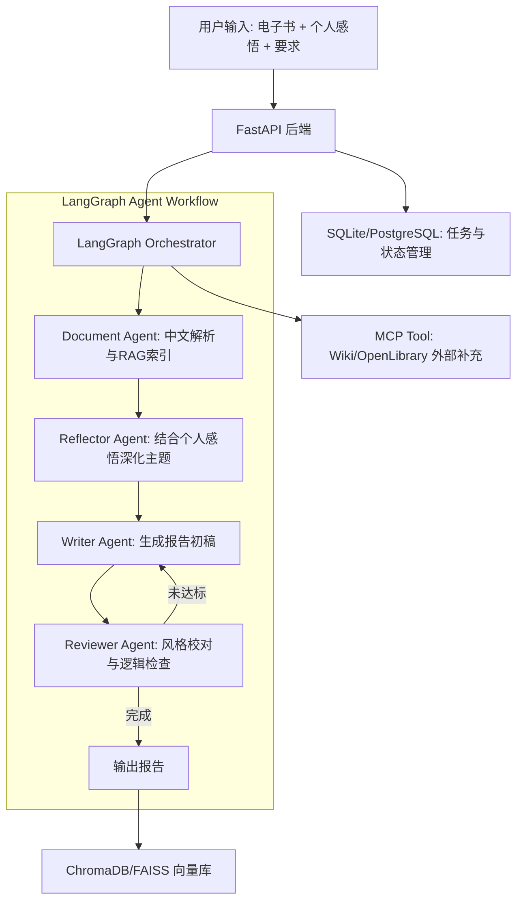

## 1. 架构设计 (核心大模型逻辑)



## 2. 技术栈 (高性价比/免费优先)
- **LLM (默认本地)**: **Ollama** (本地推理，便于离线演示与成本控制)
- **LLM (回退方案)**: **DeepSeek-V3 / SiliconFlow** (云端推理，免费额度/低单价)
- **嵌入模型**: 本地 **HuggingFace (Sentence-Transformers)**，无需 API 费用
- **后端**: FastAPI (高性能、异步支持)
- **大模型框架**: LangChain + LangGraph (状态管理与多 Agent 协作)
- **RAG**: ChromaDB (本地向量存储，完全免费)
- **中文处理**: `jieba` (分词优化)
- **工具集成**: MCP (Model Context Protocol)
- **存储**: SQLite (本地文件，无需数据库云服务费用)

### 2.1 LLM Provider 策略

系统通过“LLM Provider”抽象隔离模型调用，保证 LangGraph 工作流不被具体模型实现绑定：

- **默认路径**: `LLM_PROVIDER=ollama`，走本地 `OLLAMA_BASE_URL`，模型由 `OLLAMA_MODEL` 指定。
- **回退路径**: 当本机吞吐/延迟不达标时，将 `LLM_PROVIDER` 切换到云端（例如 `deepseek`/`siliconflow`），由对应的 `*_API_BASE`、`*_API_KEY` 提供推理能力。

建议的最小配置项：

- `LLM_PROVIDER=ollama|deepseek|siliconflow`
- `OLLAMA_BASE_URL=http://localhost:11434`
- `OLLAMA_MODEL=qwen2.5:7b`（示例）
- `CLOUD_API_BASE=...`（示例）
- `CLOUD_API_KEY=...`（示例）

## 3. 核心 API 设计 (极简版)

| 路由 | 方法 | 描述 |
|------|------|------|
| `/api/upload` | POST | 上传书籍，触发异步 RAG 索引构建 |
| `/api/generate` | POST | 提交报告要求 + **个人感悟**，启动 Agent 工作流 |
| `/api/status/{task_id}` | GET | 获取生成进度与状态 |
| `/api/report/{task_id}` | GET | 获取生成的报告内容 |
| `/api/optimize` | POST | 提交反馈，针对特定段落进行局部优化 |

## 4. 关键数据流 (Data Flow)

### 4.1 两种处理模式
1.  **主动模式 (有输入)**:
    - 用户输入（要求+感悟）-> 
    - `Document Agent` 检索相关章节 -> 
    - `Reflector Agent` 融合用户感悟与书籍核心思想 -> 
    - `Writer Agent` 按照风格预设撰写。
2.  **被动模式 (全书扫描)**:
    - 用户无输入 -> 
    - `Document Agent` 启动 **Hierarchical Map-Reduce**:
        - Step 1: 提取各章节关键句 (Chunk Summary)。
        - Step 2: 汇总章节摘要形成“全书脉络图”。
        - Step 3: `Reflector Agent` 模拟“读者视角”发现核心冲突与亮点。
    - `Writer Agent` 基于全景图生成报告。

### 4.2 基础流
1.  **解析流**: 书籍 -> 文本分块 -> 中文 Embedding -> 存入向量库。
2.  **优化流**: 选中段落 + 反馈 -> `Reflector Agent` 重新生成 -> 局部更新报告。

## 5. 数据库模型 (MVP 简化版)

```sql
-- 书籍表
CREATE TABLE books (
    id UUID PRIMARY KEY,
    title TEXT,
    author TEXT,
    file_path TEXT,
    vector_index_id TEXT, -- 关联向量库
    created_at TIMESTAMP
);

-- 报告表
CREATE TABLE reports (
    id UUID PRIMARY KEY,
    book_id UUID REFERENCES books(id),
    user_feelings TEXT, -- 用户输入的个人感悟
    settings JSON,      -- 字数、风格等
    full_content TEXT,  -- 最终生成的全文
    status TEXT,        -- pending, processing, completed, failed
    created_at TIMESTAMP
);
```
