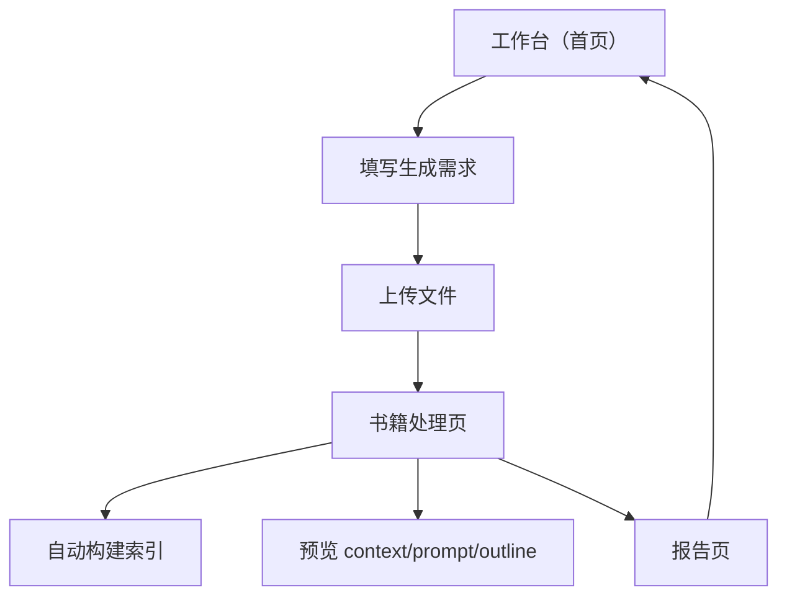

## 1. 产品概述
ReadKing 是一个面向“从书籍到可交付读书报告”的前端工作台。
你可以上传书籍、构建索引、预览生成输入（context/prompt/outline），并生成与查看报告（含大纲与 Markdown）。

## 2. 核心功能

### 2.1 功能模块
我们将产品收敛为 3 个核心页面：
1. **工作台（首页）**：上传书籍入口、书籍列表、报告列表、任务状态概览。
2. **书籍处理页**：书籍信息、索引构建、预览（context/prompt/outline）、启动报告生成。
3. **报告页**：生成状态、报告大纲、Markdown 正文查看与复制/下载。

### 2.2 页面详情
| 页面名称 | 模块名称 | 功能描述 |
|---|---|---|
| 工作台（首页） | 上传书籍 | 上传 PDF/TXT/EPUB 文件；显示上传进度与成功/失败结果 |
| 工作台（首页） | 书籍列表 | 展示书籍名称、上传时间、索引状态；支持进入书籍处理页 |
| 工作台（首页） | 报告列表 | 展示报告名称/关联书籍、生成状态、更新时间；支持进入报告页 |
| 书籍处理页 | 书籍概览 | 展示文件信息（文件名/大小）、解析状态、最近一次索引时间 |
| 书籍处理页 | 构建索引 | 触发“解析→切分→向量化→入库”；显示进度（步骤+百分比）与错误信息 |
| 书籍处理页 | 预览区 | 以只读方式预览：检索到的 context、将发送的 prompt、生成的 outline（可折叠） |
| 书籍处理页 | 生成报告 | 基于当前索引与预览内容提交生成；生成后跳转到报告页 |
| 报告页 | 状态与日志 | 展示 pending/processing/completed/failed；必要时展示简短失败原因 |
| 报告页 | 大纲视图 | 展示 outline（树/列表）；支持点击定位对应 Markdown 段落 |
| 报告页 | Markdown 视图 | 渲染并支持复制 Markdown 原文；支持下载 .md 文件 |

## 3. 核心流程
**主流程（单用户）**：
1) 你先填写“生成需求/读后感”（降低滥用与无效上传）。
2) 点击进入“上传文件”，上传成功后自动触发“构建索引”。
3) 索引完成后，你在预览区确认 context/prompt/outline。
4) 点击“生成报告”，进入报告页查看进度与结果。
5) 在报告页查看大纲与 Markdown，并复制/下载。

