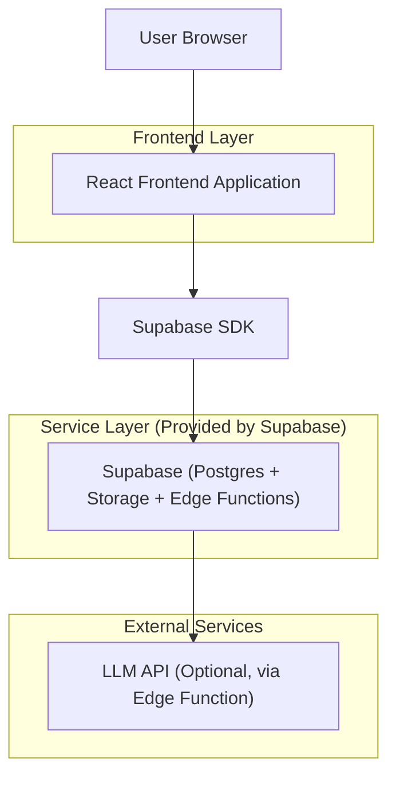
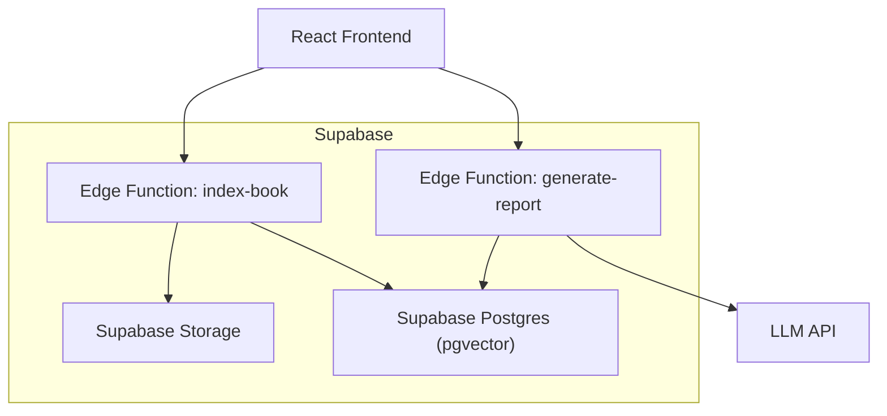
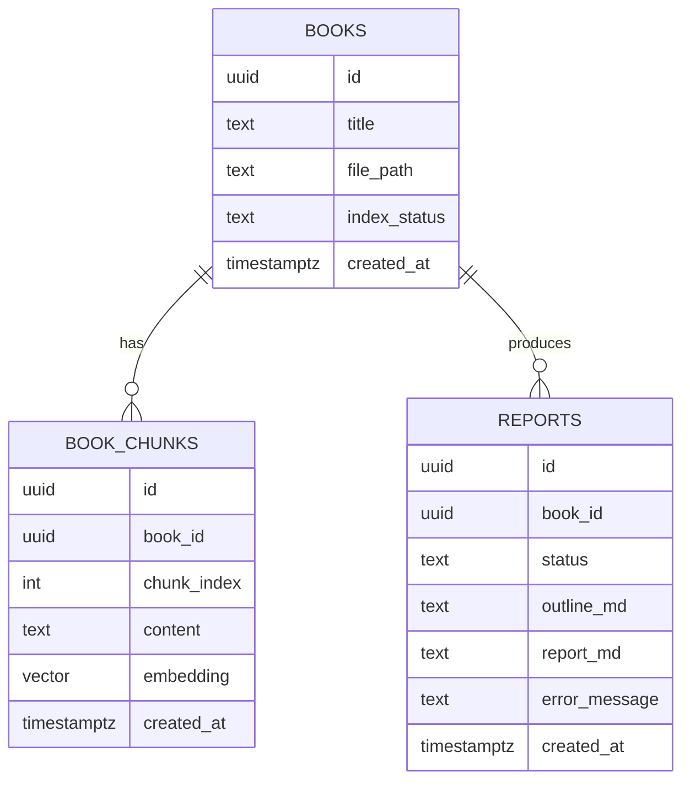

## 1.Architecture design


## 2.Technology Description
- Frontend: React@18 + TypeScript + vite + tailwindcss@3
- Backend: Supabase（Auth 可选，本方案默认不强制登录）
- Markdown: react-markdown（或等价渲染组件）

## 3.Route definitions
| Route | Purpose |
|---|---|
| / | 工作台：上传书籍、书籍/报告列表、状态概览 |
| /books/:bookId | 书籍处理：索引构建、预览 context/prompt/outline、触发生成 |
| /reports/:reportId | 报告查看：状态、大纲、Markdown 渲染与下载 |

## 4.API definitions (If it includes backend services)
本方案使用 Supabase Edge Functions 承载“索引构建/报告生成”，前端仅通过 HTTPS 调用，避免在浏览器暴露 LLM Key。

### 4.1 Core API（Edge Functions）
- POST /functions/v1/index-book
- POST /functions/v1/generate-report
- GET  /functions/v1/report?report_id=:id

共享 TypeScript 类型（前后端一致）：
```ts
export type Book = {
  id: string
  title: string
  file_path: string
  mime_type: string
  size_bytes: number
  index_status: 'not_started' | 'processing' | 'completed' | 'failed'
  created_at: string
}

export type Report = {
  id: string
  book_id: string
  status: 'pending' | 'processing' | 'completed' | 'failed'
  outline_md: string | null
  report_md: string | null
  error_message: string | null
  created_at: string
}
```

## 5.Server architecture diagram (If it includes backend services)


## 6.Data model(if applicable)

### 6.1 Data model definition


### 6.2 Data Definition Language
> 说明：按 Supabase 指引，这里使用“逻辑外键”（book_id 字段），避免物理外键约束。

```sql
-- books
CREATE TABLE books (
  id UUID PRIMARY KEY DEFAULT gen_random_uuid(),
  title TEXT NOT NULL,
  file_path TEXT NOT NULL,
  mime_type TEXT,
  size_bytes BIGINT,
  index_status TEXT NOT NULL DEFAULT 'not_started',
  created_at TIMESTAMPTZ NOT NULL DEFAULT now()
);

-- book_chunks (requires pgvector)
CREATE TABLE book_chunks (
  id UUID PRIMARY KEY DEFAULT gen_random_uuid(),
  book_id UUID NOT NULL,
  chunk_index INT NOT NULL,
  content TEXT NOT NULL,
  embedding vector(1536),
  created_at TIMESTAMPTZ NOT NULL DEFAULT now()
);
CREATE INDEX idx_book_chunks_book_id ON book_chunks(book_id);

-- reports
CREATE TABLE reports (
  id UUID PRIMARY KEY DEFAULT gen_random_uuid(),
  book_id UUID NOT NULL,
  status TEXT NOT NULL DEFAULT 'pending',
  outline_md TEXT,
  report_md TEXT,
  error_message TEXT,
  created_at TIMESTAMPTZ NOT NULL DEFAULT now()
);
CREATE INDEX idx_reports_book_id ON reports(book_id);

-- permissions (baseline)
GRANT SELECT ON books, book_chunks, reports TO anon;
GRANT ALL PRIVILEGES ON books, book_chunks, reports TO authenticated;
```
